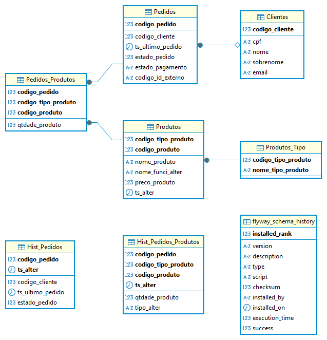

# fiap-lanchonete-db

Repositório contendo a configuração (Terraform) do banco de dados MySQL para uso no AWS RDS (Serviço gerenciado de banco
de dados).

Seguimos um modelo de banco de dados relacional devido a nossa necessidade de adequar dados estruturados, garantir a integridade dos dados através de restrições como chaves primárias e estrangeiras, a facilidade de organização e manutenção do modelo para a consulta e utilização desses dados, além de outros fatores.
O MySql foi utilizado como ferramenta devido a sua popularidade e com isso o suporte que a mesma possui. É uma ferramenta confiável, robusta e flexível que atendeu todas as nossas demandas.

### Modelo Entidade-Relacionamento do nosso banco de dados



### Regras de Normalização

1FN. Todos os atributos das nossas tabelas são atômicos, por exemplo um produto pode ter mais de um tipo de produto, o que levou a tabela Produtos_Tipo, que identifica quais tipos de produtos existem.

2FN. A tabela intermediária Pedidos_Produtos depende da tabela Pedidos e Produtos, identificando quais produtos entram em cada Pedido. A necessidade da coluna qtdade_produto para identificar a quantidade de cada produto existe em cada pedido justifica sua inclusão nessa tabela.

3FN. Poderíamos ter optado por criar uma nova tabela ou adicionar na tabela Pedidos_Produtos uma nova coluna que calculasse o valor total do pedido conforme a coluna preco_produto na tabela Produtos e qtdade_produto na tabela Pedidos_Produtos, mas retiramos completamente esse dado e optamos por deixar o cálculo para a camada de negócio.

## Ordem de execução

A maioria dos projetos nessa organização exporta e importa estados no backend compartilhado do Terraform (utilizando
HCP).
Sendo assim, no primeiro deploy, os projetos devem ser executados na seguinte ordem:

```
fiap-lanchonete-auth
fiap-lanchonete-infra
fiap-lanchonete-db
fiap-lanchonete-api
```

**Importante**: esse passo só é necessário caso você esteja "subindo" o projeto pela primeira vez,
como em uma troca de organização do HCP ou troca de conta do AWS.
Essa ordem garante que os projetos exportarão as variaveis necessárias no backend compartilhado corretamente.  
Nos demais casos (como CI/CD, execuções do `terraform apply` posteriores),
a ordem de execução não é importante.

## Instalação e Execução

### Pre-requisitos

Certifique-se de ter instalado uma versão recente da CLI do `terraform`.

### Variaveis de ambiente

É necessário criar algumas variaveis de ambiente para viabilizar a aplicação das configurações pelo CLI do Terraform.  
Para ambiente local, basta utilizar o arquivo `dev.auto.tfvars.example` como exemplo, criando um `dev.auto.tfvars`
correspondente:

```hcl
aws_access_key = "ASIAVEZQ3WJY2KR216362"
aws_secret_key = "TU+qlmgcNsX5MQz1238214821748211"
aws_token_key  = "123872183721857128874821......."
db_user = "fiap" # usuario do DB
db_password = "fiap-lanchonete"  # senha do db_user
```

_Atenção: essas credenciais são inválidas, e servem apenas como exemplo. Você deve obter as credenciais corretas do
próprio ambiente da AWS. Todas as variáveis são obrigatórias._

Caso você utilize o `AWS CLI`, os parametros no arquivo `~/.aws/credentials` podem ser utilizados para autenticação.
A tabela abaixo relaciona as credenciais especificadas nas variaveis do Terraform com as presentes no arquivo
`~/.aws/credentials`.

| tfvars         | ~/.aws/credentials    |
| -------------- | --------------------- |
| aws_access_key | aws_access_key_id     |
| aws_secret_key | aws_secret_access_key |
| aws_token_key  | aws_session_token     |

### Estrutura

Esse repositório faz uso da funcionalidade de `modules` do Terraform, onde um arquivo principal (`main.tf`) orquestra o
deploy
de sub-modulos (pasta `modules`), passando as variaveis necessárias.
Para realizar os comandos (`terraform apply`, etc). Apenas as variaveis presentes no arquivo `variables.tf` devem ser
preenchidas.  
Estas estão especificadas logo acima.

## Aplicar configurações

Inicialize os módulos do Terraform do repositório:

```shell
terraform init
```

Com a configuração realizada, basta executar o seguinte comando para validar a configuração e conferir as alterações
que serão realizadas:

```shell
terraform plan
```

Caso o comando execute corretamente, você está devidamente autenticado em alguma instância válida do `AWS`.  
Para aplicar as alterações, basta rodar o seguinte comando e inserir 'yes' quando solicitado:

```shell
terraform apply
```

Em caso de erro, verifique se o usuario executante tem permissões para criações de instâncias do AWS RDS, VPC e Subnets.

**Importante**: Caso seja a primeira "subida" do projeto, siga a ordem de execução
especificada [aqui](#ordem-de-execução).

### Dicionário

#### Clientes

```
codigo_cliente - identificador interno do cliente
cpf - cpf do cliente (único)
nome - nome do cliente
sobrenome - sobrenome do cliente
email - email do cliente
```

#### Pedidos

```
codigo_pedido - identificar interno do pedido
codigo_cliente - chave estrangeira que identifica o cliente
ts_ultimo_pedido - timestamp da última alteração do pedido (seja estado, alteração no conteúdo, etcs)
estado_pedido - em qual estado o pedido esta (INICIADO, RECEBIDO, EM_PREPARACAO, PRONTO, FINALIZADO, CANCELADO)
estado_pagamento - estado em qual se encontra o pagamento do pedido (RECUSADO, APROVADO)
codigo_id_externo - identificador externo gerado pela integração com a API da solução de pagamento
```

#### Pedidos_Produtos

```
codigo_pedido - chave estrangeira que identifica o pedido
codigo_tipo_produto - chave estrangeira que identifica o tipo do produto
codigo_produto - chave estrangeira que identifica o produto
qtdade_produto - quantifica quantos produtos foram selecionados no pedido
```

#### Produtos

```
codigo_tipo_produto - chave estrangeira que identifica o tipo do produto
codigo_produto - identificar interno do pedido que identifica o produto
nome_produto - o nome do produto
nome_funci_alter - indica qual funcionário alterou esse produto
preco_produto - indica o preço do produto
ts_alter - timestamp da última alteração
```

#### Produtos_Tipo

```
codigo_tipo_produto - identificador interno que identifica o tipo do produto
nome_tipo_produto - o nome desse tipo de produto
```

#### Hist_Pedidos

```
codigo_pedido - identifica o número do pedido
ts_alter - timestamp em que esse histórico foi registrado
codigo_cliente - chave estrangeira que identifica o cliente
ts_ultimo_pedido - timestamp da última alteração do pedido (seja estado, alteração no conteúdo, etcs)
estado_pedido - em qual estado o pedido esta (INICIADO, RECEBIDO, EM_PREPARACAO, PRONTO, FINALIZADO, CANCELADO)
```

#### Hist_Pedidos_Produtos

```
codigo_pedido - chave estrangeira que identifica o pedido
codigo_tipo_produto - chave estrangeira que identifica o tipo do produto
codigo_produto - chave estrangeira que identifica o produto
ts_alter - timestamp em que esse histórico foi registrado
qtdade_produto - quantifica quantos produtos foram selecionados no pedido
tipo_alter - tipo de alteração registrada no histórico (I - Inclusão, A - Alteração, D - Deleção)
```
